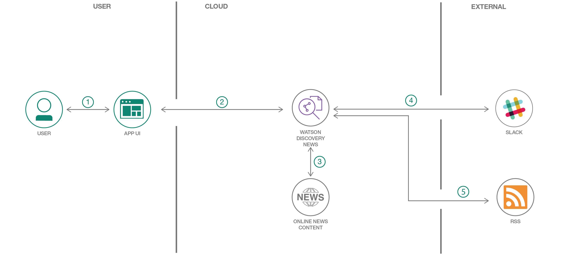

# llSPS-INT-148-AI-Powered-News-Search-App-Level-1-
AI Powered News Search App (Level-1)
PURPOSE
	This app allows the user to search for any news at any time. The Watson discovery service used has an inbuilt collection of news in various topics which brings news to the doorstep in a jiffy.

FLOWCHART

1. The user interacts with the app UI to request relevant news content.
2. The app sends user requests to Watson Discovery News.
3. The Watson Discovery Service is continually crawling the web to update its Discovery News collection.
4. The Watson Discovery Service responds to Slack search requests.
